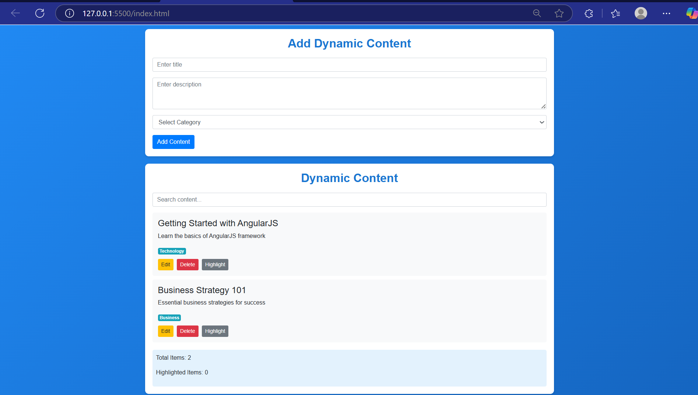

# Live-Content-Manager-with-AngularJS

A dynamic, responsive web application built using **AngularJS** that allows users to add, edit, highlight, delete, and search content entries in real-time. Ideal for demos, educational use, or personal mini-projects.

---

## ✨ Features

- 📌 Add new content dynamically (title, description, category)
- 🖍️ Edit existing content using inline prompts
- 🧹 Delete unwanted entries
- 🌟 Highlight items visually
- 🔍 Live search functionality
- 📊 Real-time content statistics
- 🎨 Beautiful and responsive UI using Bootstrap 4

## live-content-manager-angularjs
├── index.html       
├── README.md        
├── package.json 

## 🚀 Getting Started

### Prerequisites

To run this app, you only need a modern web browser and optionally a local server like Live Server in VS Code.
